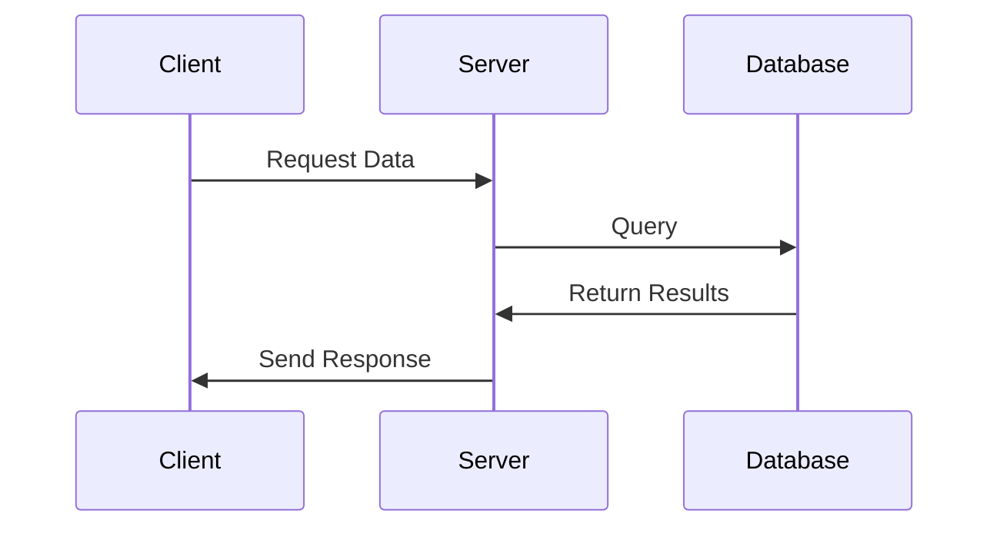

# The Ultimate Guide to Slidev: Syntax, Features, and Best Practices

## Introduction

Slidev is a presentation tool designed for developers. Unlike traditional presentation software, Slidev leverages the power of Markdown, allowing you to focus on content while still delivering visually stunning presentations.

This guide focuses on how to write slides in Slidev, incorporating best practices for creating engaging presentations. You'll learn syntax, slide organization, animations, and other features that make Slidev a powerful tool for technical presentations.

> **Key Recommendation**: Always pair your slides with detailed speaker notes and use [click] markers to synchronize your notes with your animations. This is one of the most valuable features of Slidev and will significantly improve your presenting experience.

## Basic Slide Structure

### Slide Separators

Use `---` with newlines before and after to separate your slides:

```md
# Slide 1

Content for the first slide

---

# Slide 2

Content for the second slide
```

### Headmatter and Frontmatter

The first YAML block in your presentation is called **headmatter** and configures the entire deck:

```md
---
theme: default
title: My Presentation
background: https://source.unsplash.com/collection/94734566/1920x1080
class: text-center
highlighter: shiki
lineNumbers: false
---

# My Presentation

Welcome to Slidev!
```

Individual slides can have their own configuration using **frontmatter**:

```md
---
layout: center
background: ./images/background-1.png
class: text-white
---

# This slide has a custom layout and background
```

## Layouts

Layouts define the structure of your slides. By default, the first slide uses the `cover` layout, and the rest use `default`.

To change a slide's layout, specify it in the frontmatter:

```md
---
layout: two-cols
---

# Left Column

This content appears on the left

::right::

# Right Column

This content appears on the right
```

Common built-in layouts include:
- `default`: Standard slide with title and content
- `cover`: Title slide layout
- `center`: Content centered horizontally and vertically
- `image-right`: Text on left, image on right
- `section`: Section divider slide
- `two-cols`: Two-column layout
- `quote`: For prominent quotations

## Working with Speaker Notes

Speaker notes are essential for delivering effective presentations. In Slidev, you add notes using HTML comments at the end of each slide:

```md
# Slide Title

Slide content appears on the presentation

<!--
These are speaker notes.
They will only be visible in presenter mode.
Add detailed talking points here to reference during your presentation.
-->
```

### Using Click Markers in Speaker Notes

**Click markers** are one of Slidev's most powerful features for presenters. They allow you to synchronize your speaker notes with the click animations on your slides, making it much easier to stay coordinated during your presentation.

Simply add `[click]` at the beginning of any line in your notes to mark content that corresponds to the next click animation:

```md
# Progressive Revelation

<v-clicks>

- First point
- Second point
- Third point with sub-details

</v-clicks>

<!--
[click] For the first point, I should explain the initial concept clearly
This is still part of the first click notes

[click] When the second point appears, I'll provide a specific example
Remember to mention the case study here

[click] For the third point, I'll dive deeper into the implementation details
This shows how everything connects together
-->
```

You can also skip multiple clicks using `[click:n]` where n is the click number:

```md
# Complex Slide

<div v-click>First element</div>
<div v-click>Second element</div>
<div v-click>Third element</div>
<div v-click>Fourth element</div>

<!--
[click] Talk about the first element

[click:3] Skip directly to the third element
We're skipping over the second one in our notes

[click:4] And now explain the fourth element
-->
```

In presenter mode, Slidev will automatically highlight the corresponding notes section as you advance through your presentation, making it much easier to stay on track.

### Best Practice: Slide + Notes + Click Markers Pattern

For the most effective presentations, follow this pattern:
1. Create your slide with concise, visual content
2. Add click animations to control the flow of information
3. Write detailed speaker notes with click markers to stay synchronized

Example:

```md
# JavaScript Promises

<v-clicks>

- Handles asynchronous operations
- Returns a single value
- States: pending, fulfilled, rejected
- Chainable with .then() and .catch()

</v-clicks>

<!--
[click] Promises solve asynchronous operations elegantly.
They represent future values and help us avoid callback hell.

[click] Unlike callbacks that might return multiple values, a Promise always resolves to exactly one value.

[click] When I mention states, I should explain:
  - Pending: Initial state, operation not completed
  - Fulfilled: Operation completed successfully
  - Rejected: Operation failed

[click] The real power comes from chaining - I'll emphasize how this creates readable async code
-->
```

## Styling Your Slides

### Using UnoCSS Utility Classes

Apply styles directly in your markdown with UnoCSS:

```md
<div class="text-center">
  <h1 class="text-4xl color-teal-500 mb-4">Centered Title</h1>
  <p class="opacity-75 italic">This text has custom styling</p>
</div>
```

### Embedded Styles

Add scoped styles to individual slides:

```md
# Styled Slide

<style>
h1 {
  color: #42b883;
  font-size: 3em;
}
</style>
```

## Interactive Components

### Using Vue Components

You can use Vue components directly in your slides:

```md
# Interactive Demo

<Counter :count="10" />
```

### Adding Clickable Elements

Add interactivity with the `v-click` directive:

```md
# Sequential Points

<v-clicks>

- First point appears initially
- Second point appears on click
- Third point appears on another click

</v-clicks>
```

## Code Blocks

### Basic Code Block

```md
# Working with Code

```js
function greeting(name) {
  return `Hello, ${name}!`;
}
```
```

### Line Highlighting

```md
# Highlight Important Code

```js {2-3|5|all}
function example() {
  // These lines (2-3) are highlighted first
  const x = 100;

  // Then this line (5) is highlighted
  return x + 42;
}
```
```

### Editable Code

```md
# Live Coding Demo

```js {monaco}
// This becomes a fully functional editor
function calculate(x, y) {
  return x + y;
}
```
```

## Animations

### Click Animations

Use Slidev's click system to reveal content progressively:

```md
# Progressive Disclosure

<div v-click>Shows after first click</div>

<div v-click>Shows after second click</div>

<div v-click>Shows after third click</div>
```

### Animated Lists

```md
# Animated List

<v-clicks>

- First item
- Second item
- Third item
  - Nested item
  - Another nested item

</v-clicks>
```

### Additional Click Marker Examples

Click markers create a synchronized experience between your slides and notes:

```md
# Key Features

<v-clicks>

- Real-time collaboration
- End-to-end encryption
- Cross-platform support
- Offline capabilities

</v-clicks>

<!--
[click] When we talk about real-time collaboration, our system updates changes within 100ms globally

[click] End-to-end encryption ensures that not even our servers can read your data

[click] Available on iOS, Android, Windows, Mac, and Linux with the same feature set

[click] All features work offline with automatic syncing when connectivity returns
-->
```

The click markers in presenter mode will:
- Automatically highlight the current section of notes
- Scroll to the relevant section as you advance
- Provide visual guidance on what to say next
- Keep you perfectly in sync with your slide animations

### Transitions

Add transitions between slides in the frontmatter:

```md
---
transition: slide-left
---

# Slide With Transition

This slide transitions from right to left
```

Available transitions include: `fade`, `slide-up`, `slide-down`, `slide-left`, and `slide-right`.

## Images and Diagrams

### Adding Images

```md
# Image Example


<!-- Use HTML for more control -->

```

### Creating Diagrams with Mermaid

```md
# Architecture Diagram


```

## LaTeX Support

```md
# Mathematical Equations

Inline equation: $E = mc^2$

Block equation:

$$
\frac{d}{dx}e^x = e^x
$$
```

## Best Practices for Effective Slides

### 1. Keep Content Concise

- Limit text content (5-7 bullet points maximum)
- Use short phrases rather than complete sentences
- Put detailed explanations in speaker notes

### 2. Use a Visual Hierarchy

- Make important information stand out through size, color, or positioning
- Use consistent styling for similar elements
- Leave adequate white space

### 3. Progressive Disclosure

- Reveal information gradually using v-click
- Helps audience focus on current point
- Prevents information overload

### 4. Use Animations Purposefully

- Animations should enhance understanding, not distract
- Use click animations to guide attention
- Consider slide transitions that reinforce relationships between content

### 5. Speaker Notes Structure

- Add context that isn't on the slide
- Include relevant statistics, quotes, or examples
- Note potential questions and prepared answers
- Add timing reminders if needed

## Example: A Well-Structured Slide

Here's a complete example showcasing a well-structured slide with animations and speaker notes:

```md
---
layout: default
---

# User Authentication System

<v-clicks>

- Multi-factor authentication support
- GDPR-compliant data handling
- Biometric identity verification
- Anomaly detection for suspicious logins

</v-clicks>

<div v-click class="mt-10 flex gap-4">
  <div class="flex-1 border border-gray-400 rounded p-4 bg-gray-100">
    <h3 class="text-lg font-bold mb-2">99.99%</h3>
    <p class="text-sm">Uptime last quarter</p>
  </div>
  <div class="flex-1 border border-gray-400 rounded p-4 bg-gray-100">
    <h3 class="text-lg font-bold mb-2">< 200ms</h3>
    <p class="text-sm">Authentication time</p>
  </div>
  <div class="flex-1 border border-gray-400 rounded p-4 bg-gray-100">
    <h3 class="text-lg font-bold mb-2">150M+</h3>
    <p class="text-sm">Users protected</p>
  </div>
</div>

<!--
[click] Our authentication system supports various methods beyond passwords, including SMS, email, authenticator apps, and hardware keys

[click] We've designed the entire system with privacy by design principles, ensuring GDPR compliance from the ground up

[click] We now support fingerprint, facial recognition, and voice identification on supported devices

[click] Our ML system detects unusual login patterns based on time, location, device, and behavior patterns

[click] These statistics highlight our system's reliability and performance - emphasize that authentication happens in under 200ms in 95% of cases
-->
```

## Click Markers: A Presenter's Best Friend

Click markers deserve special attention as they solve one of the biggest challenges in presenting: knowing exactly what to say at each step of your presentation. Here's why they're so valuable:

1. **Perfect synchronization** - Your notes automatically highlight and scroll in sync with your slide animations
2. **Reduced cognitive load** - You never have to mentally track which talking point goes with which animation
3. **Confident delivery** - With clear visual guidance, you can focus on engaging with your audience
4. **Better time management** - You can see precisely how your content maps to each animation

For presenters who use animations extensively, click markers transform the experience from potentially chaotic to completely structured and predictable.

## Conclusion

Slidev combines the simplicity of Markdown with the power of web technologies to create engaging presentations. By following the practices outlined in this guide, you can create slides that are not only visually appealing but also effective at communicating your message.

Remember these key points:
- Keep slides concise, put details in speaker notes
- **Always use [click] markers to synchronize your notes with your animations**
- Use animations purposefully to guide attention
- Leverage code highlighting for technical presentations
- Structure your presentation as: concise slides → click animations → detailed notes with click markers

Happy presenting with Slidev!
